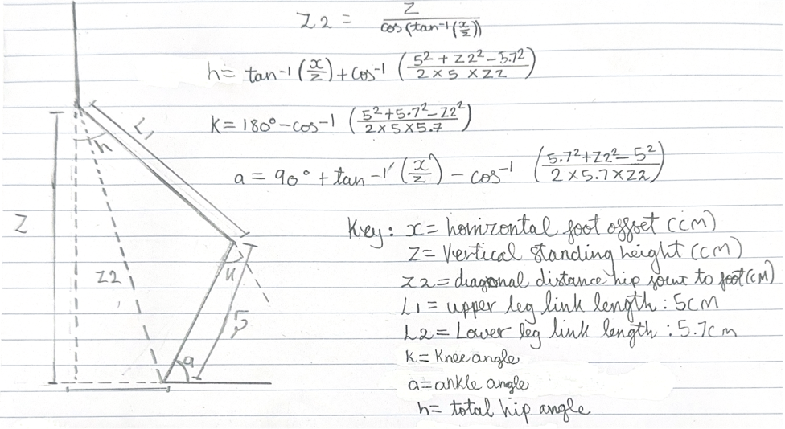

# Bipedal Walking Robot: Walking, Towing and Squatting

Second year engineering team project, University of Kent (team of four)

## Summary
- **Robot:** 6 servo bipedal robot (hip, knee and ankle on each leg), controlled by an M5StickS3 and an M5Unit 8Servo board over I2C
- **Modes:** walking, towing a weighted sled, and squatting while holding a load
- **Squat:** 4.5 cm squat depth, holding 1.5 kg in weight holder
- **Towing:** 1 kg towed on a wheeled sled, up from 200 g with the original sled
- **Control:** WiFi web interface hosted on the robot, with physical start/stop buttons and a Time-of-Flight sensor for obstacle stopping

## My Role: Robot Kinematics and Movement
I was responsible for the robot's movement code:
- Implemented the inverse kinematics used for the walking gait
- Wrote and tuned the walking gait (`takeStep()`), including step length, step clearance and timing
- Wrote the squatting routine (`squatDown()`, `standUp()`, `smoothMove2()`) and tuned the standing and squat angles
- Ran the walking and squat testing, changing one set of parameters at a time and logging each trial

The walking and squatting code was then integrated with the control, safety and web interface code by a teammate.

## Team Roles
- **Me:** robot kinematics and movement
- **Teammates:** mechanical design and hardware, controls and security, sensor integration, sustainability and electrical testing

## Hardware
- M5StickS3 microcontroller (ESP32-S3)
- M5Unit 8Servo control board (I2C)
- 6 servo motors: HipL, HipR, KneeL, KneeR, AnkleL, AnkleR (3 DOF per leg in the sagittal plane)
- Time-of-Flight distance sensor (shares the I2C bus with the servo board)
- Rechargeable LiPo battery
- Physical start and stop buttons
- 3D printed PLA parts, redesigned in Fusion 360

## Movement

### Walking (inverse kinematics)
- Each leg is modelled as a two-link chain, with link lengths L1 = 5 cm and L2 = 5.7 cm (from Technovation, 2020)
- Inverse kinematics works backwards from a target foot position (x, z) to the hip, knee and ankle angles. This is done in `pos()`. The full derivation is shown in the inverse kinematics diagram (image 1)
- `updateServoPos()` applies calibration offsets for each joint and sends the angles to the servos
- `takeStep()` sweeps each foot from +stepLength to -stepLength at a constant height, with one foot swinging forward while the other moves back
- The swing foot is lifted by a step clearance so it doesn't drag, which shifts the robot's weight from foot to foot
- Final gait values: 1.5 cm step length, 0.5 cm increments, 75 ms delay per increment (about 0.5 s per half cycle)
- The robot starts from a squat and rises to a 9.5 cm standing height in 0.1 cm increments before walking, since starting fully upright made it extend too fast and fall

### Squatting
- The squat moves between two known positions, so it uses fixed target angles rather than inverse kinematics
- Squat angles are defined as offsets from the standing angles (hips 35°, knees 70°, ankles 40°), so retuning the standing posture automatically updates the squat
- The standing posture uses asymmetric offsets, since a 90° neutral made the robot lean forward and lose balance under load
- `smoothMove2()` moves every joint over 50 steps with a 15 ms delay per step, avoiding sudden jumps that tipped the robot over
- Squat depth was improved from 3.5 cm to 4.5 cm through tuning

### Towing
- Uses the walking gait at a slightly slower, more stable setting, with a sled tied to the robot's tow hook

## Mechanical Design (team)
Redesigned parts (Fusion 360, PLA):
- **Feet:** larger footprint for stability, then reinforced after the first version snapped
- **Knees:** reinforced corners and added cable management holes, iterated twice after breaking in testing
- **Hip:** two separate hip pieces replaced with one unified part to stop them flexing inward, with mounts for the M5StickS3 and sensors
- **Top section:** battery laid flat to lower the centre of gravity, plus a tow hook and space for weights
- **Sled:** wheels added after floor friction limited towing to 200 g
- **Weight holder:** three iterations, ending with a larger flat cradle holding up to 1.7 kg

## Control, Safety and Security (team)
- **Web interface:** hosted on the robot using LittleFS, works on phones and computers. Buttons send requests to the robot, which runs the matching function
- **Task scheduling:** FreeRTOS tasks, with a mutex so the ToF sensor and servo board don't clash on the shared I2C bus
- **Physical buttons:** interrupt-driven start and stop, working even with no device connected
- **Obstacle stop:** ToF sensor polled every 500 ms, with an adjustable stopping distance set from the website
- **Wi-Fi security:** robot runs as its own access point with WPA3 and a long password, limited to one connected client
- **Channel selection:** scans the 2.4 GHz band and picks the least congested channel

## Results
| Attribute | Baseline robot (week 4) | Final robot |
|---|---|---|
| Squatting | Tipped over under load | 4.5 cm squat, 1.5 kg in holder |
| Towing | 200 g | 1 kg with wheeled sled |
| Walking | Legs moved one at a time, knees and ankles bent backwards | Stable walk after tuning offsets, step clearance and friction pads |
| Control | Separate programs uploaded for each test | Combined code, controlled from website or physical buttons |

## Testing
- Walking and squat parameters were changed one at a time in `constants.h`, with each trial repeated 1 to 3 times and logged
- Early walking tests were run with the robot suspended on a test stand, then on the table, then on the floor
- Squat depth was measured with a ruler and joint angles with a protractor, with load increased in 500 g steps
- A tow was counted as successful if the robot pulled the load 10 cm without falling

## Images

**1. Inverse kinematics diagram**
Hand-drawn two-link model of one leg, showing the hip (h), knee (k) and ankle (a) angles, the link lengths L1 and L2, and the equations used to calculate each joint angle from the foot position.

**2. Robot squatting with 1.5 kg**
The assembled robot in its squat position, holding 1.5 kg in the weight holder.

**3. Robot towing**
The assembled robot towing a weighted load on the wheeled sled.

## How to Run
- Open the final integrated code in the Arduino IDE with the ESP32 board package installed
- Upload the web interface files to LittleFS
- Upload the sketch, connect to the robot's Wi-Fi access point, and open the control page

## Limitations
- Walking speed and distance weren't measured quantitatively, so walking was assessed visually
- The robot never walked fully straight. It leaned to the right, partly due to having only 3 DOF per leg
- Squat and towing results come from a small number of trials

## Future Work
- Measure walking speed and straightness quantitatively
- Add an accelerometer/IMU for balance feedback and fall detection
- Low power mode when idle
- Show the current mode on the M5StickS3 screen
- Recycled PETG instead of PLA for less brittle parts

## Files
- `finalproject.html`: final integrated code (movement, web control, safety, security)
- `walkingrobot.html`: standalone walking code used for gait testing
- `squatingrobot.html`: standalone squat code used for squat testing
- `movingRobot.html`: earlier movement code
- `asyncwebtest-2.html`: web interface test
- `ik_diagram.png`: inverse kinematics diagram
- `Robot squating 1.5kg .png`: photo of the robot squatting with 1.5 kg
- `Robot towing.png`: photo of the robot towing

## Reference
Technovation (2020), bipedal robot inverse kinematics:https://www.instructables.com/id/Arduino-Controlled-Robotic-Biped
